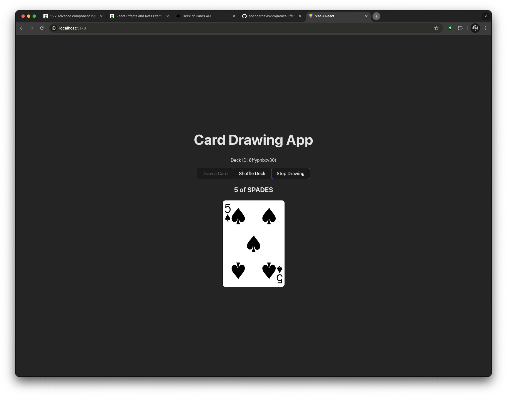

# 🎴 React Effects and Refs Exercise

## **Overview**

This is a React application that interacts with the [Deck of Cards API](https://deckofcardsapi.com/).  
It demonstrates the use of **React Hooks (`useState`, `useEffect`, `useRef`)** by allowing users to:

- Draw a card from a shuffled deck.
- Shuffle the remaining deck.
- Enable an **"Auto-Draw"** mode that draws a card every second until stopped or the deck is empty.

---

## **🚀 Features**

- **Draw a Card** – Fetches a card from the deck and displays it.
- **Shuffle Deck** – Shuffles remaining cards and resets the display.
- **Auto-Draw Mode** – Automatically draws a new card every second until stopped.

---

## **📸 Screenshot**

Here’s a preview of the app in action:

---

## **🔧 Installation & Setup**

### **1️⃣ Prerequisites**

Ensure you have **Node.js** and **npm** installed.

### **2️⃣ Clone the Repository**

git clone https://github.com/YOUR_GITHUB_USERNAME/React-Effects-and-Refs-Exercise.git  
cd React-Effects-and-Refs-Exercise

### **3️⃣ Install Dependencies**

npm install

### **4️⃣ Run the App**

npm run dev

Then open `http://localhost:5173` in your browser.

---

## **🛠️ Technologies Used**

- **React** (Vite)
- **JavaScript (ES6+)**
- **Deck of Cards API** (for deck management)
- **React Hooks** (`useState`, `useEffect`, `useRef`)

---

## **📂 File Structure**

/src  
 ├── components/  
 │ ├── Deck.jsx # Main component handling deck logic  
 ├── App.jsx # Root component  
 ├── main.jsx # React entry point  
 ├── index.css # Minimal styles  
 ├── assets/ # Contains screenshots or images (optional)

---

## **📌 How It Works**

### **1️⃣ Fetching a New Deck (`useEffect`)**

- When the app loads, it **fetches a shuffled deck** from the API.
- The deck ID is **stored in state (`useState`)** so it can be used in future API calls.

### **2️⃣ Drawing a Card (`useState`)**

- Clicking **"Draw a Card"** fetches a new card and updates the UI.
- If no cards remain, the app **alerts the user and stops drawing**.

### **3️⃣ Auto-Draw (`useRef` + `setInterval`)**

- Clicking **"Start Auto-Draw"** begins an interval that **draws a card every second**.
- Clicking **"Stop Drawing"** stops the interval.
- Auto-draw **automatically stops when the deck runs out**.

### **4️⃣ Stopping Auto-Draw (`useRef`)**

- We store the **interval ID inside `useRef`** so it persists across renders.
- When stopping auto-draw, we call `clearInterval(drawInterval.current)`.

---

## **📌 Future Improvements**

- Improve UI/UX with animations and styling.
- Allow users to track **previously drawn cards**.
- Improve **error handling** with toast notifications instead of alerts.

---

## **📝 License**

This project is open-source and available under the [MIT License](LICENSE).

---

## **📬 Contact**

If you have any questions or suggestions, feel free to **open an issue** or **submit a pull request**.
